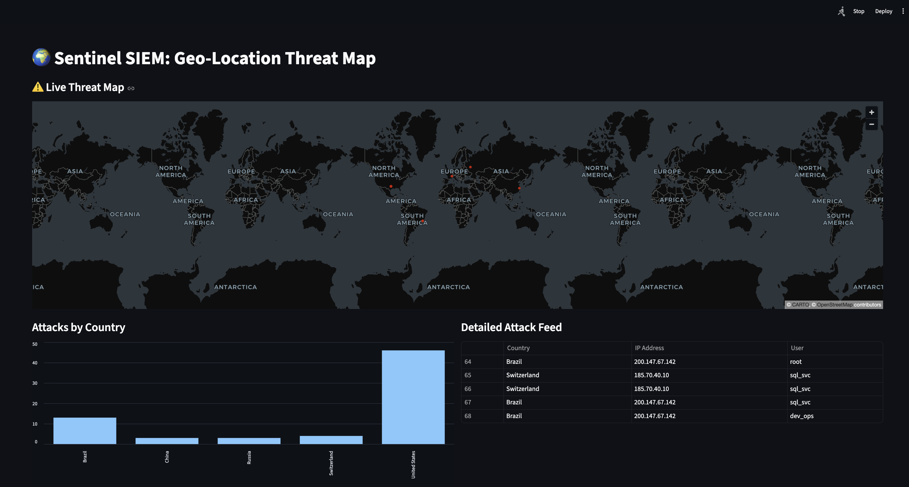
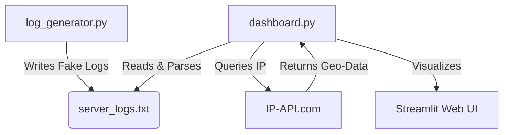

# 🛡️ Sentinel: Real-Time SIEM & Threat Intelligence Map

**Sentinel** is a lightweight Security Information and Event Management (SIEM) system built to simulate, detect, and visualize network attacks in real-time. It replicates the core functionality of enterprise SOC tools by aggregating logs, detecting brute-force patterns, and enriching data with Geo-Location Threat Intelligence.

---

## 📸 Dashboard Preview




---

## 🚀 Features

### 1. Attack Simulation Engine
- Generates realistic **SSH authentication logs** (`sshd`)
- Simulates global traffic using real public IP addresses from multiple countries (China, Russia, Brazil, USA, etc.)
- Randomizes attack frequency to mimic "Low and Slow" vs. "Brute Force" patterns

### 2. Log Ingestion & Parsing
- Reads raw system logs in real-time (similar to `tail -f`)
- Uses **Regular Expressions (Regex)** to parse unstructured log data into structured fields (Timestamp, Source IP, User, Status)

### 3. Threat Intelligence Enrichment
- Integrated with the **IP-API** service
- Automatically resolves attacker IP addresses to **Physical Geo-Coordinates** (Latitude/Longitude) and Country of Origin

### 4. Real-Time Visualization (SOC Dashboard)
- **Live Threat Map:** Plots attacker origins on an interactive world map
- **Attack Metrics:** Tracks "Total Failed Logins," "Unique Attackers," and "Most Targeted User"
- **Live Feed:** Distinct table showing the most recent attempted breaches

---

## 🛠️ Architecture

The system consists of three main components working in parallel:



**Component Breakdown:**
- **Generator:** Acts as the "Victim Server," writing logs to a file
- **Parser:** Reads the file, applies Regex filters to find Failed password events
- **Visualizer:** Renders the parsed data onto a Streamlit dashboard

---

## 📂 Project Structure

```
Sentinel-SIEM/
│
├── log_generator.py          # Script to generate fake attack logs
├── dashboard.py              # Main Streamlit dashboard application
├── server_logs.txt           # The log file (created automatically)
├── requirements.txt          # List of Python dependencies
├── README.md                 # Project documentation
└── assets/
    └── dashboard_preview.png # Screenshot for README
```

---

## 💻 Installation & Setup

### Prerequisites
- Python 3.10+ installed
- An internet connection (for the Geo-Location API)

### Step 1: Clone the Repository

```bash
git clone https://github.com/saadhan-p/sentinel-siem.git
cd sentinel-siem
```

### Step 2: Install Dependencies

Create a `requirements.txt` file with the following content:

```txt
streamlit
pandas
requests
```

Then install the dependencies:

```bash
pip install -r requirements.txt
```

---

## ⚡ Usage Guide

To simulate a real-time environment, you must run the **Generator** and the **Dashboard** in separate terminals.

### Terminal 1: Start the Attack Simulation

This will start writing logs to `server_logs.txt`:

```bash
python log_generator.py
```

**Expected Output:**
```
[*] Simulating GLOBAL traffic to server_logs.txt...
```

### Terminal 2: Launch the SOC Dashboard

This will start the web server and open your browser:

```bash
streamlit run dashboard.py
```

The dashboard will open at **http://localhost:8501**

---

## 🧠 Skills Demonstrated

- **Python Scripting:** File handling, loop management, and modular coding
- **Data Engineering:** ETL (Extract, Transform, Load) logic using Pandas and Regex
- **API Integration:** Consuming REST APIs to enrich security data
- **SOC Operations:** Understanding how analysts view and triage threats
- **Real-Time Visualization:** Building interactive dashboards with Streamlit

---

## 🔮 Future Roadmap

- [ ] **Alerting:** Add Discord/Slack webhook integration for critical alerts (e.g., >5 failures/min)
- [ ] **Database:** Switch from a text file to SQLite for persistent storage
- [ ] **User Agents:** Analyze HTTP logs to detect SQL Injection patterns
- [ ] **Machine Learning:** Implement anomaly detection for zero-day threats
- [ ] **Multi-Protocol Support:** Extend to FTP, RDP, and HTTP logs

---

## 🤝 Contributing

Contributions are welcome! Please feel free to submit a Pull Request.

1. Fork the Project
2. Create your Feature Branch (`git checkout -b feature/NewFeature`)
3. Commit your Changes (`git commit -m 'Add some NewFeature'`)
4. Push to the Branch (`git push origin feature/NewFeature`)
5. Open a Pull Request

---

## 📄 License

Distributed under the MIT License. See `LICENSE` for more information.

---

## 📧 Contact

**Your Name**  
[LinkedIn Profile](https://www.linkedin.com/in/saadhan-p/) | [GitHub Profile](https://github.com/your-username)

---

## 🙏 Acknowledgments

- [Streamlit](https://streamlit.io/) for the amazing dashboard framework
- [IP-API](https://ip-api.com/) for free IP geolocation services
- The cybersecurity community for inspiration and best practices

---

**⭐ If you find this project useful, please consider giving it a star!**